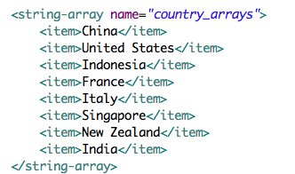

Spinner组件是Android当中非常常用的一种用于下拉选择的组件。

本blog当中主要解决的几个问题：
- 如何在XML中初始化Spinner选项
- 如何使用代码的方式初始化Spinner选项
- 一个Activity当中多个Spinner的监听

如何在XML中初始化Spinner选项
---

打开`res/values`在其中创建`arrays.xml`文件。添加如下内容：

> Written with [LeoChin](https://leochin.com/).