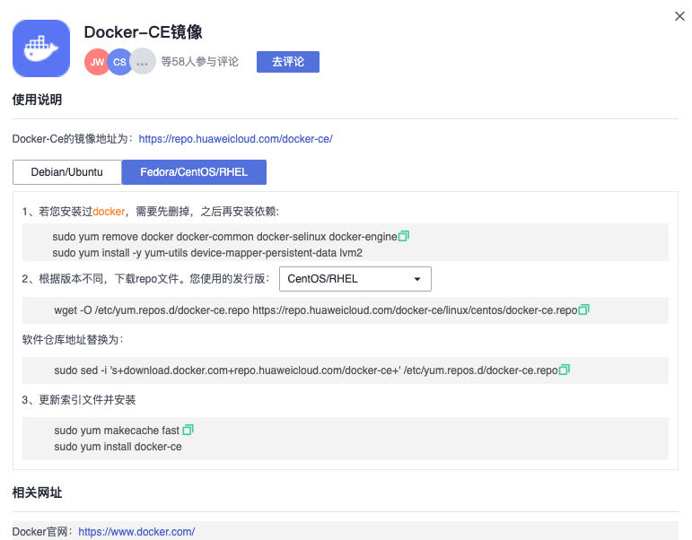
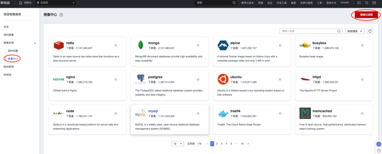
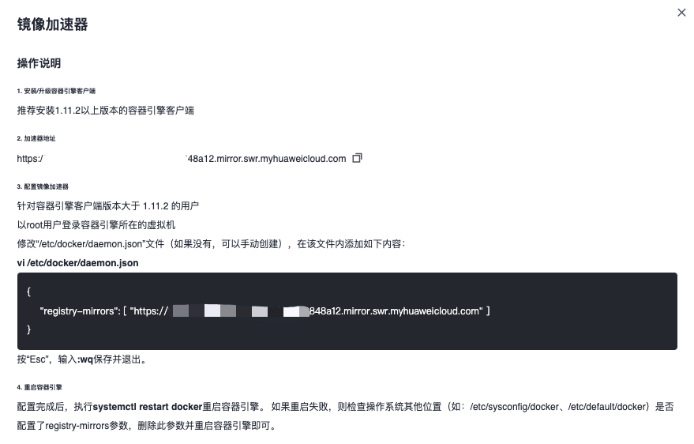

使用华为云耀云服务器CentOS 7.9版本。
# docker安装
参考华为云开源镜像中Docker-CE镜像的配置。



```shell
sudo yum install -y yum-utils device-mapper-persistent-data lvm2

wget -O /etc/yum.repos.d/docker-ce.repo https://repo.huaweicloud.com/docker-ce/linux/centos/docker-ce.repo

sudo sed -i 's+download.docker.com+repo.huaweicloud.com/docker-ce+' /etc/yum.repos.d/docker-ce.repo

sudo yum makecache fast
sudo yum install -y docker-ce

sudo systemctl start docker
```

PS：注意以上命令在CentOS8中有问题，只推荐在CentOS7中使用。
# docker-compse安装
直接从docker-compse在github的项目中下载指定平台和架构的二进制文件。
比如linux平台 x86_64平台。

```shell
curl -L https://github.com/docker/compose/releases/download/v2.19.0/docker-compose-linux-x86_64 -o /usr/local/bin/docker-compose
chmod +x /usr/local/bin/docker-compose
```

# 华为云docker镜像加速
在华为云中支持docker镜像加速。
登录华为云账号后找到SWR服务后，如下图找到镜像加速器按钮。



弹出如下配置：



配置完成后，重启docker

```shell
sudo systemctl restart docker
```

# 资料
- [https://docs.docker.com/engine/install/centos/](https://docs.docker.com/engine/install/centos/)
- [https://mirrors.tuna.tsinghua.edu.cn/help/docker-ce/](https://mirrors.tuna.tsinghua.edu.cn/help/docker-ce/)


